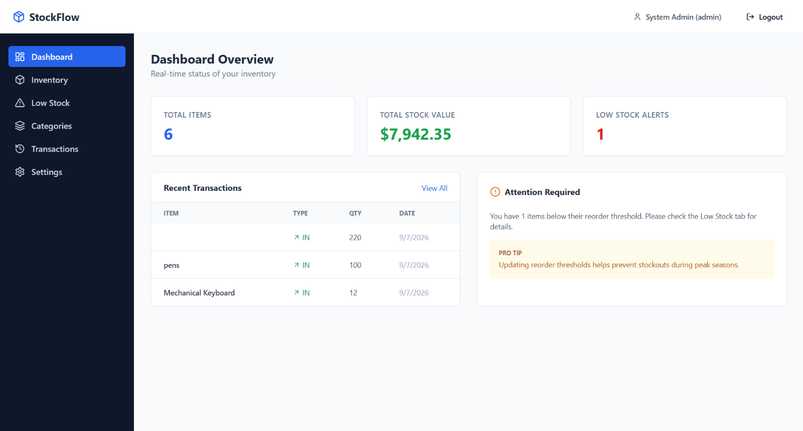

# 📦 StockFlow — Enterprise Inventory Intelligence



**StockFlow** is a pragmatic, high-performance inventory tracking system designed for internal warehouse and retail operations. Moving away from generic SaaS templates, StockFlow employs a utilitarian, "internal-tool" design language—prioritizing data density, operational speed, and absolute reliability.

Built with the **MERN stack**, it streamlines the complex lifecycle of stock management, from initial procurement to real-time movement tracking and automated low-stock intelligence.

🌐 **Status:** Production-Ready / Local Deployment

---

## ⚡ Tech Stack & Architecture

This application utilizes a decoupled architecture to ensure scalability and maintainability:

| Layer | Technology | Description |
|---|---|---|
| **Frontend** | React 18 + Vite | Ultra-fast bundling and a component-based UI for real-time updates. |
| **Styling** | Tailwind CSS | Custom design tokens focusing on a neutral, professional "Enterprise" palette. |
| **Backend** | Node.js + Express | RESTful API architecture with optimized middleware for auth and error handling. |
| **Database** | MongoDB + Mongoose | Document-based storage for flexible item schemas and transaction logging. |
| **Auth** | JWT + bcryptjs | Secure, stateless authentication with role-based access control (Admin/Staff). |
| **Icons** | Lucide React | Minimalist, consistent iconography for a clean professional interface. |

---

## ✨ Key Features & Operational Highlights

* **Utilitarian Design Language:** Eschews flashy gradients for a clean, high-contrast interface inspired by tools like Linear and Notion. Focuses on usability over "fluff."
* **Atomic Stock Movements:** Instead of simply editing a number, StockFlow implements a strict "Stock In/Out" workflow. Every change is logged as a unique transaction, providing a full audit trail for every single item.
* **Real-time Intelligence:** A dynamic dashboard that calculates total stock value and triggers "Low Stock" alerts the moment an item falls below its custom reorder threshold.
* **Role-Based Access Control (RBAC):** Distinguishes between `Admin` (full CRUD and category management) and `Staff` (stock adjustments and viewing), mimicking real-world corporate hierarchies.
* **Advanced Catalog Management:** Full CRUD capabilities for items and categories, featuring real-time search, multi-parameter filtering, and dynamic sorting.
* **Responsive Operations:** A fully adaptive layout that allows warehouse staff to manage stock on tablets or mobile devices via a collapsing sidebar pattern.

---

## 🔑 Demo Credentials

To quickly test the system after seeding the database, use the following accounts:

| Role | Email | Password |
|---|---|---|
| **Admin** | `admin@stockflow.com` | `password123` |
| **Staff** | `staff@stockflow.com` | `password123` |

---

## 🛠️ Setup & Run Locally

### Prerequisites
* Node.js 18+
* MongoDB Atlas account (or local MongoDB installation)

### 1. Clone & Install
```bash
git clone https://github.com/your-username/stockflow.git
cd stockflow
```

**Backend Setup:**
```bash
cd server
npm install
```

**Frontend Setup:**
```bash
cd ../client
npm install
```

### 2. Environment Configuration
Create a `.env` file in the `server/` directory:
```env
PORT=5000
MONGO_URI=mongodb+srv://<user>:<password>@cluster.mongodb.net/stockflow
JWT_SECRET=your_random_secure_string_here
```

### 3. Initialize & Seed Data
To populate the system with realistic product data, categories, and admin accounts:
```bash
cd server
npm run seed
```

### 4. Start the Application
**Start Server:** `npm run dev` (inside `/server`)
**Start Client:** `npm run dev` (inside `/client`)

Open [http://localhost:3000](http://localhost:3000) to access the system.

---

## 📂 Project Architecture

```
stockflow/
├── server/                 # Backend API
│   ├── config/             # DB connection logic
│   ├── controllers/        # Business logic (Auth, Items, Transactions)
│   ├── middleware/          # JWT Auth & Global Error Handling
│   ├── models/             # Mongoose Schemas (User, Item, Category, Transaction)
│   └── routes/             # REST API Endpoint definitions
├── client/                 # Frontend UI
│   ├── src/
│   │   ├── api/            # Axios instance with Auth interceptors
│   │   ├── components/     # Shared UI (Navbar, Sidebar, StatCards)
│   │   ├── context/        # Global Auth State management
│   │   └── pages/          # Feature-specific views
└── README.md
```

---

## 📈 Future Roadmap

As a living project, the following enterprise-grade features are slated for implementation:
* **CSV/PDF Export**: One-click generation of inventory audits and transaction reports.
* **Advanced Analytics**: Integration of Recharts for stock trend visualization over time.
* **Automated Notifications**: Email/Slack alerts triggered automatically when stock hits critical levels.
* **Bulk Import**: CSV upload capability for rapid inventory onboarding.

---

*Designed as a showcase of pragmatic full-stack engineering and operational efficiency.*
